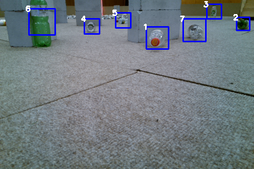
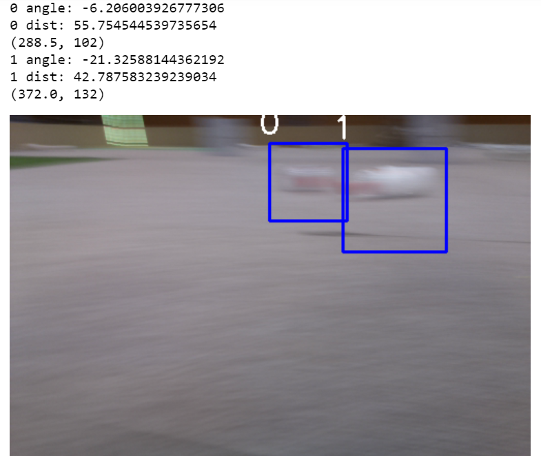
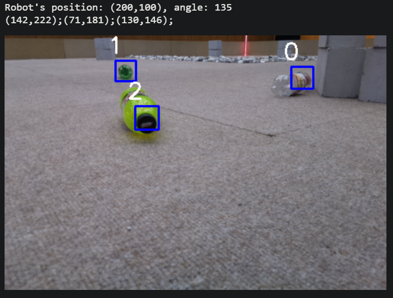
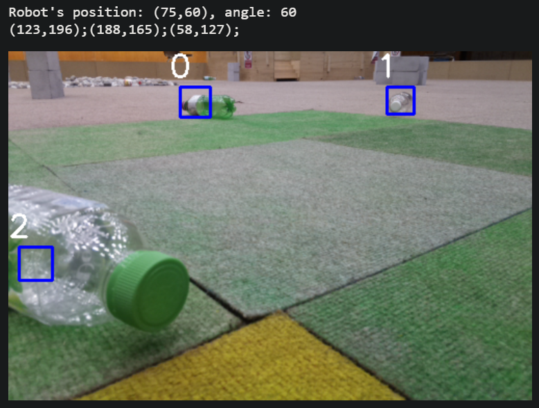
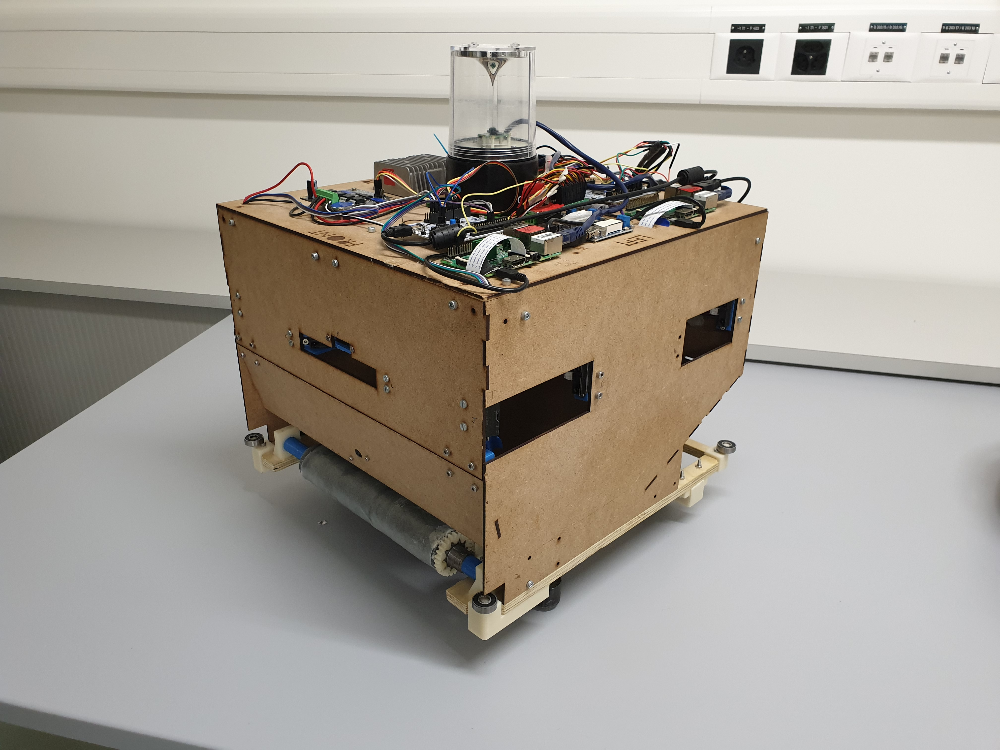
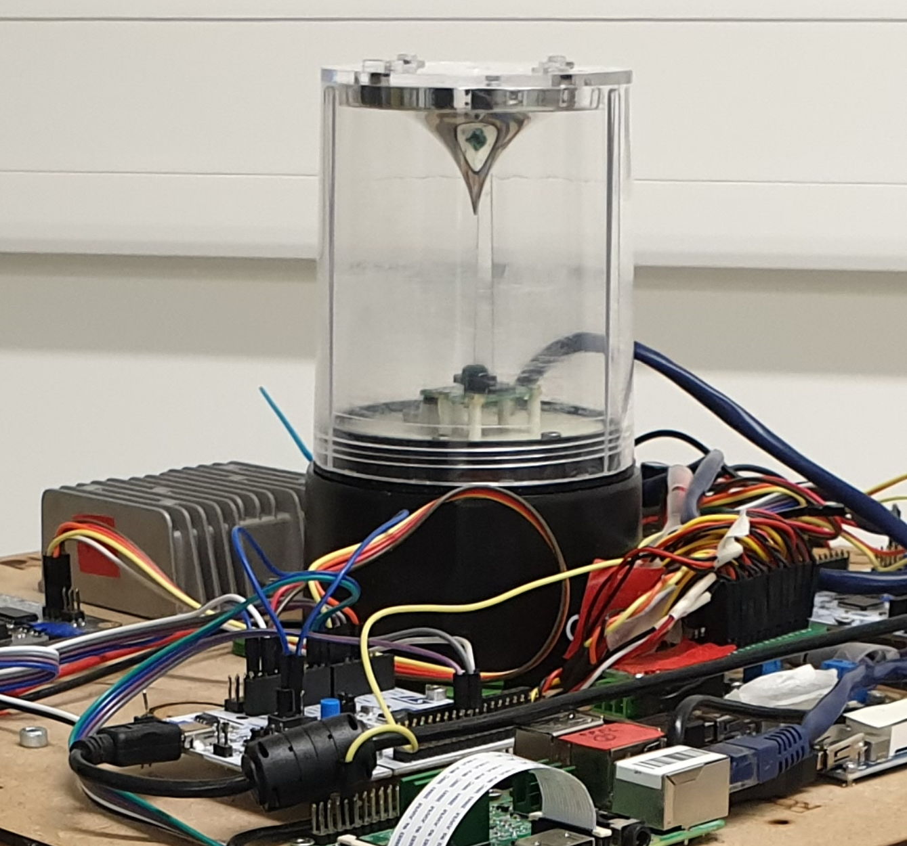
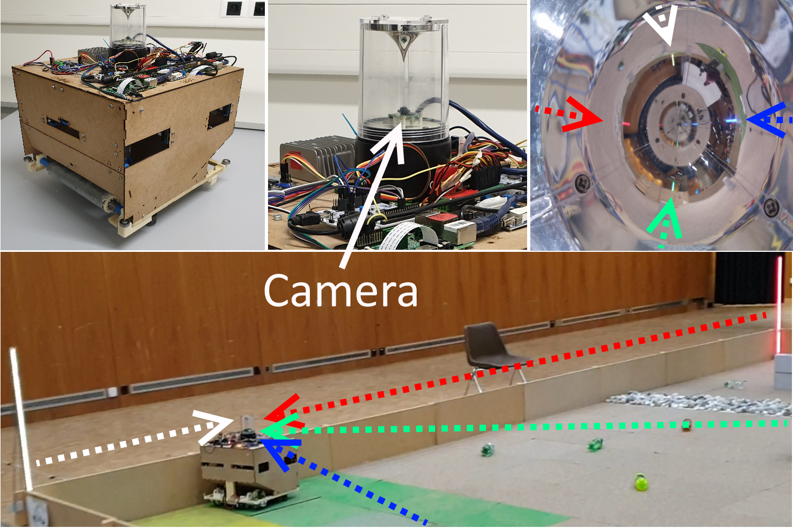

# Visual recognition

Project: https://apiquet.com/2019/06/02/visual-recognition/

# DESCRIPTION:

You can find here the code I used for the EPFL (Ecole Polytechnique Fédérale de Lausanne) Robotics Competition. I had to build a standalone robot from scratch which recognizes any kind of bottles, catch it, then bring it to a recycling bin. 
It must overcome obstacles like rocks, take ramps, run over grass, etc. 

I'm in charge of the collector (front of the robot to catch and store bottles), the bottle storage, the bottle recognition and the triangularization of the robot's position and orientation through a beacon. 
This repository is for the bottle recognition and the position triangularization.
You can find them under **bottle_recognition** folder and **beacon** folder.

For the bottle recognition part, I tried several techniques such as the Python lib ImageAI, OpenCV filtering and ML approaches with an Haar Cascade. You can find it in the Jupyter notebook called **main** under the **bottle_recognition** folder.

Some results for the visual recognition part:

Set up of the homemade beacon on the robot:

